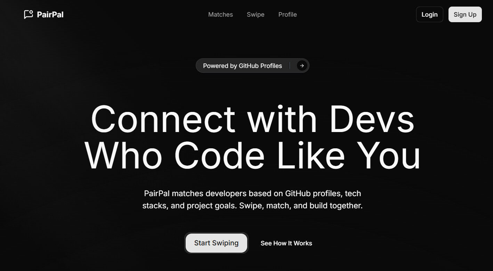
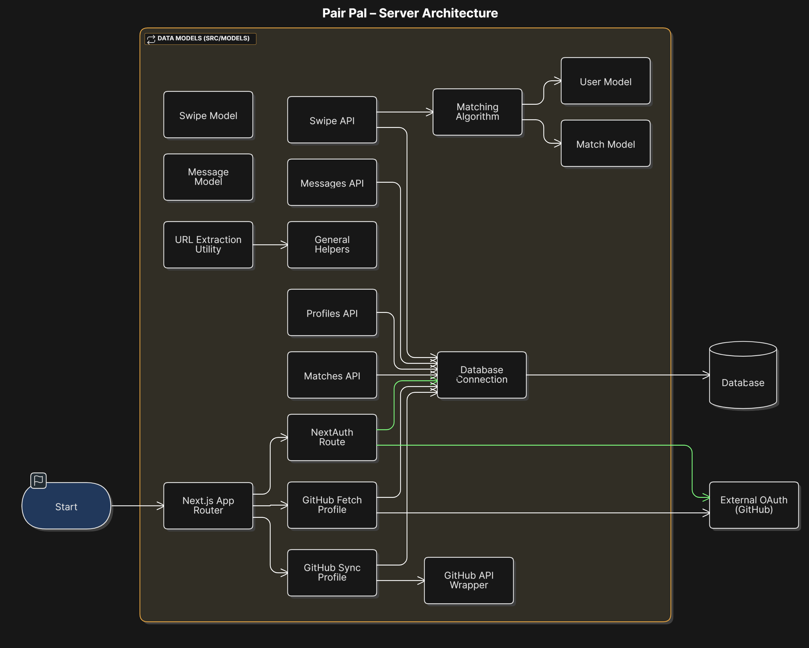

<br>

Pair Pal is a matchmaking and messaging platform for developers, built with Next.js (App Router), MongoDB, and GitHub OAuth. It leverages public GitHub data to create rich user profiles and match users based on their interests, activity, and repositories.

## Features
- **GitHub OAuth**: Sign in with your GitHub account (public data only, no private repo access)
- **Profile Enrichment**: Fetches and syncs your public GitHub profile, repositories, and organizations
- **Matching Algorithm**: Matches users based on languages, topics, and activity
- **Messaging**: Send and receive messages with your matches
- **Swipe/Discovery**: Swipe to like or pass on other users

## Architecture Overview



## Getting Started

1. **Clone the repository**
2. **Install dependencies**
   ```bash
   npm install
   # or
   yarn install
   # or
   pnpm install
   ```
3. **Set up environment variables**
   - Copy `.env.example` to `.env.local` and fill in your GitHub OAuth credentials and MongoDB URI.
4. **Run the development server**
   ```bash
   npm run dev
   # or
   yarn dev
   # or
   pnpm dev
   ```
5. Open [http://localhost:3000](http://localhost:3000) in your browser.


## GitHub Integration
- Uses [NextAuth.js](https://next-auth.js.org/) with GitHub provider
- Only requests public data (`read:user user:email read:org` scopes)
- No private repository data is accessed or stored

---

> _This project is for educational and demo purposes. Contributions are welcome!_

---

<a href="https://github.com/yashksaini-coder">
    <table>
        <tbody>
            <tr>
                <td align="left" valign="top" width="14.28%">
                    
                    <br/>
                    <h4 align="center">
                        <b>Yash K. Saini</b>
                    </h4>
                    <div align="center">
                        <p>(Author)</p>
                    </div>
                </td>
                <td align="left" valign="top" width="85%">
                    <p>
                        👋 Hi there! I'm <u><em><strong>Yash K. Saini</strong></em></u>, a self-taught software developer and a computer science student from India.
                    </p>
                    <ul>
                     <li>
                        Building products & systems that can benefit & solve problems for many other DEVs.
                    </li>
                </td>
            </tr>
        </tbody>
    </table>
</a>
